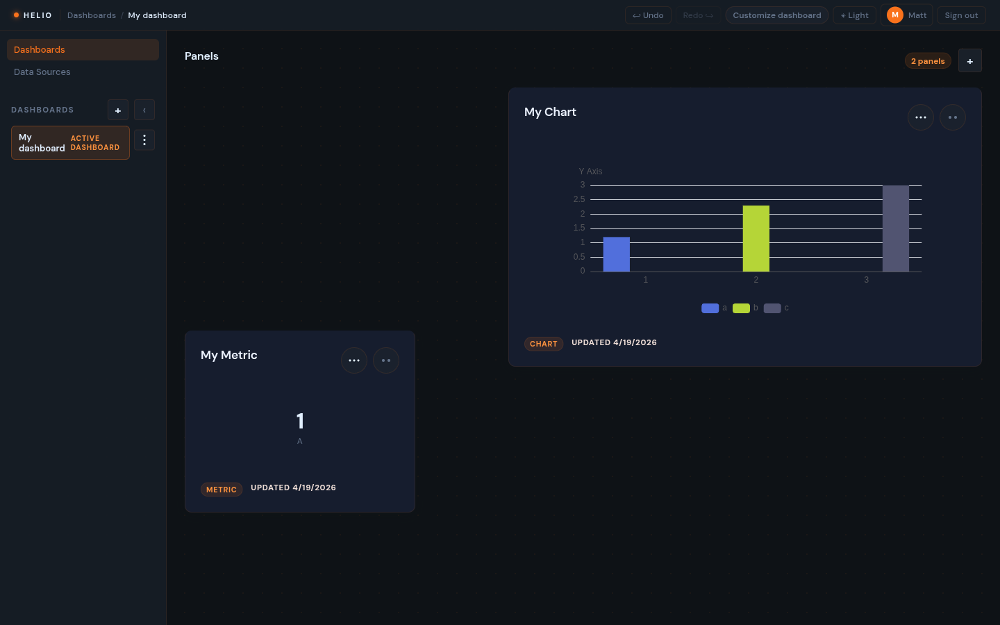
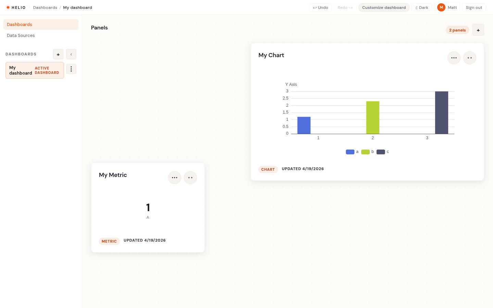

# Helio

Helio is a dashboard builder that lets you create, arrange, and customize panels to visualize your data. Panels support charts, metrics, tables, and text — all draggable and resizable on a responsive grid.





## What you can do

- Create multiple dashboards and switch between them instantly
- Add panels (charts, metrics, tables, text) and arrange them freely via drag-and-drop
- Resize panels across four responsive breakpoints (lg / md / sm / xs)
- Customize dashboard and panel appearance — background, transparency, text color
- Connect data sources and map fields to chart axes
- Import and export dashboards
- Light and dark theme

## Project Structure

```
helio/
├── frontend/          # React/Redux/TypeScript app
│   └── src/
│       ├── components/    # UI components (DashboardList, PanelGrid, ...)
│       ├── features/      # Redux slices (dashboards, panels)
│       ├── services/      # Axios service layer
│       ├── store/         # Redux store
│       ├── theme/         # ThemeProvider + appearance helpers
│       └── types/         # Shared TypeScript model types
├── backend/           # Scala/Akka HTTP server
│   └── src/main/scala/com/helio/
│       ├── api/           # Routes, request validation, JSON protocols
│       ├── domain/        # Domain models and value types
│       ├── infrastructure/ # Slick repositories and DB wiring
│       └── app/           # Server entry point
├── schemas/           # JSON Schema definitions for API payloads
└── openspec/          # API specs and change history
```

## Tech Stack

| Layer            | Technology                                               |
| ---------------- | -------------------------------------------------------- |
| Frontend         | React 18, TypeScript, Redux Toolkit, React Grid Layout   |
| Backend          | Scala 2.13, Akka HTTP, Slick, PostgreSQL                 |
| API contracts    | JSON Schema 2020-12                                      |
| Frontend tooling | Vite, ESLint, Prettier, Jest                             |
| Backend testing  | ScalaTest, embedded PostgreSQL (via `embedded-postgres`) |

## Running Locally

### Prerequisites

- Node.js 18+
- JDK 21
- sbt 1.x
- PostgreSQL

### Backend

Create a `.env` file in `backend/`:

```env
DATABASE_URL=jdbc:postgresql://localhost:5432/helio?user=helio&password=secret
AKKA_LICENSE_KEY=<your-key>
```

Start the server on port 8080:

```bash
cd backend
sbt run
```

### Frontend

```bash
npm install
npm run dev
```

The Vite dev server starts on port 5173 and proxies `/api` and `/health` to `localhost:8080`.

## Development Commands

### Frontend (from `frontend/` or repo root)

```bash
npm run dev           # Start dev server
npm run build         # Production build
npm test              # Run Jest tests
npm run lint          # ESLint (zero-warnings policy)
npm run lint:fix      # Auto-fix lint issues
npm run format        # Format with Prettier
npm run format:check  # Check formatting without modifying
```

### Backend (from `backend/`)

```bash
sbt run   # Start server
sbt test  # Run ScalaTest suite
```

## Running in production

Helio's backend is distributed as a Docker image. The frontend is bundled into
the same image and served as static files via the Akka HTTP server.

### Environment variables

| Variable           | Required | Description                                                      |
| ------------------ | -------- | ---------------------------------------------------------------- |
| `DATABASE_URL`     | Yes      | JDBC connection string, e.g. `jdbc:postgresql://host:5432/helio` |
| `AKKA_LICENSE_KEY` | Yes      | Akka commercial license key (required by Akka HTTP)              |

### Build the Docker image

From the repository root:

```bash
docker build -t helio-backend .
```

The multi-stage build compiles the fat JAR with sbt, then packages it into a
minimal JRE image. The resulting image exposes port `8080`.

### Database migrations

Flyway migrations run automatically when the server starts. No separate
migration command is required. Migrations are located in
`backend/src/main/resources/db/migration/`.

### Deploy to Cloud Run

```bash
gcloud run deploy helio \
  --image gcr.io/<PROJECT_ID>/helio-backend \
  --platform managed \
  --region <REGION> \
  --port 8080 \
  --set-env-vars "DATABASE_URL=jdbc:postgresql://<HOST>:5432/helio,AKKA_LICENSE_KEY=<KEY>" \
  --allow-unauthenticated
```

Replace `<PROJECT_ID>`, `<REGION>`, `<HOST>`, and `<KEY>` with your values.
Push the image to Container Registry before deploying:

```bash
docker tag helio-backend gcr.io/<PROJECT_ID>/helio-backend
docker push gcr.io/<PROJECT_ID>/helio-backend
```

### Logs

The backend writes structured logs to stdout. On Cloud Run, stdout is
automatically forwarded to **Cloud Logging**.

- **Google Cloud console**: Navigate to Logging → Log Explorer, filter by
  `resource.type="cloud_run_revision"` and your service name.
- **gcloud CLI**:
  ```bash
  gcloud run services logs read helio --region <REGION>
  ```

## Contributing

See [CONTRIBUTING.md](CONTRIBUTING.md).
