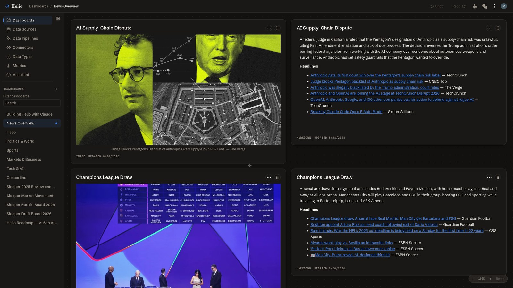
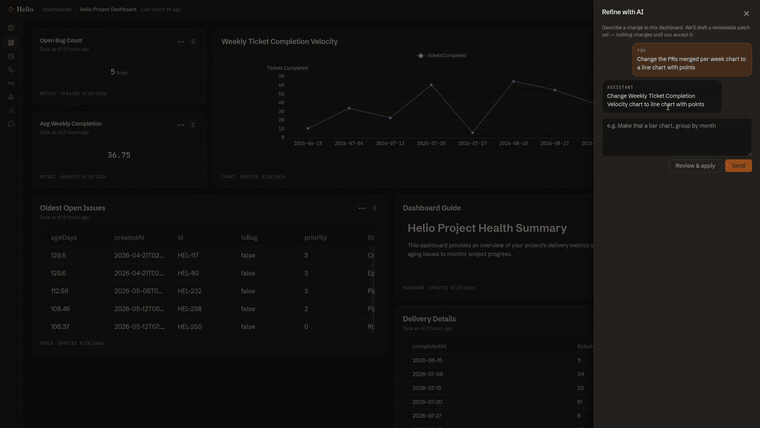
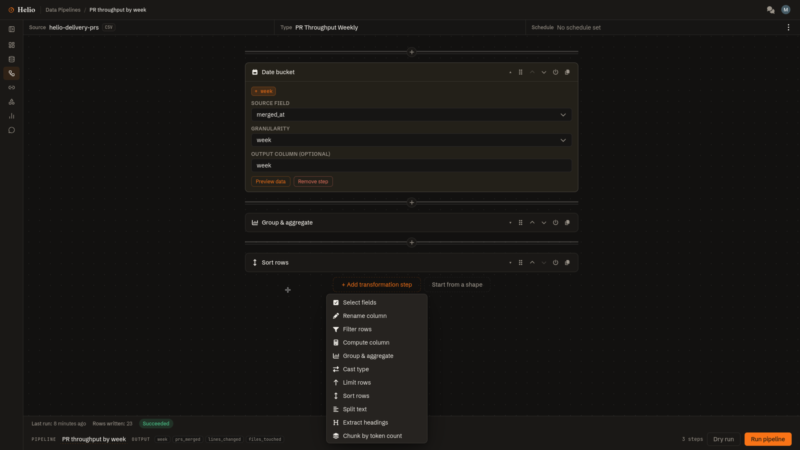
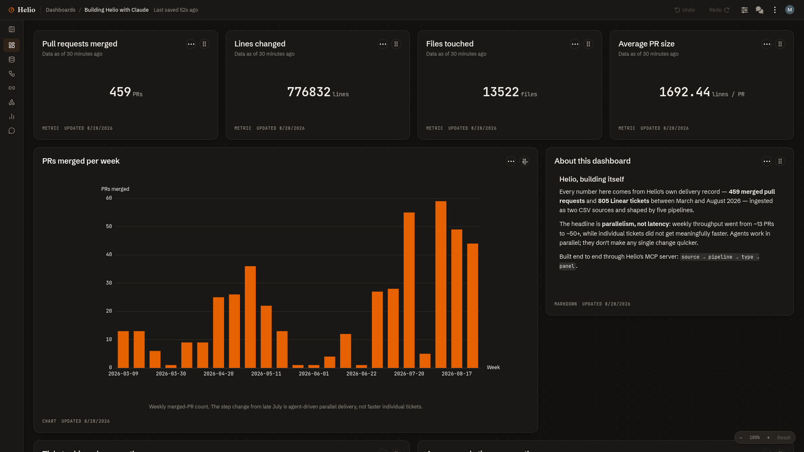

# Helio

**Helio turns raw data into dashboards you can build by asking.**

Point it at a CSV, a SQL database, or a REST API. Shape the data with a visual
pipeline. Place any node's tail as an Output — a table, a metric, a chart — and
arrange them on a responsive grid. Then keep going in plain language: describe a
change, review the exact diff, and apply it.

[helioapp.dev](https://helioapp.dev)



## Describe a change, review it, apply it

Helio's assistant edits real dashboards. It never applies anything silently: every
request becomes a **patch set** you see as a before/after diff, accept or reject,
and undo afterwards.



## How data flows

Everything in Helio follows one path, and every panel is a placement of an Output:

```
Data source  →  Pipeline  →  Outputs  →  Dashboard
   CSV            filter       table       panel
   SQL            aggregate    metric      panel
   REST           date bucket  chart       panel
   files          join, pivot  ...         panel
```

A **pipeline** is an ordered list of transformation steps over one source. Twenty-three operations ship today — filter, aggregate, join, pivot, window, unpivot, date
bucket, lookup, dedupe, and more — each previewable step by step, with the output
schema computed before you run it.



An **Output** places a live tail of the pipeline's node tree — the whole source, or
any intermediate step — as a table, metric, chart, or other kind. A dashboard panel
is a placement of one Output; because binding always goes through an Output, a
panel can never silently drift from the shape of its data.

## What you can build

The dashboard below is built from Helio's own delivery record — 459 merged pull
requests and 805 Linear tickets — ingested as two CSVs and shaped by five
pipelines.



- **Panels** — a placement of an Output (chart, metric, table, timeline,
  collection kind), plus markdown, text, image
- **Pipelines** — 20 transformation ops, step-by-step preview, dry runs,
  cron/interval schedules, and assertions that flag untrustworthy runs
- **Outputs** — place any node's tail as a table, metric, chart, or other kind;
  bind multiple panels to the same Output
- **Alerts** — threshold rules over pipeline output, with snooze and resolve
- **Connectors** — reusable, encrypted credentials shared across sources
- **Mobile** — installable PWA with a layout built for phones
- **Sharing** — export and import dashboards as portable JSON

## Agent-native

Helio is designed to be driven by agents as well as people. The same operations the
UI performs are available over an **MCP server** (`helio-mcp/`), authenticated with
a personal access token — list sources, author pipelines, create and bind panels,
propose a whole dashboard, apply a patch set, undo it.

The delivery-analytics dashboard above was built end to end through that server.

## Documentation

|                                     |                                                      |
| ----------------------------------- | ---------------------------------------------------- |
| Local setup, database, environment  | [`docs/cloud-dev-setup.md`](docs/cloud-dev-setup.md) |
| Architecture, commands, conventions | [`CLAUDE.md`](CLAUDE.md)                             |
| Deployment and infrastructure       | [`docs/deployment.md`](docs/deployment.md)           |
| Design language and UI standards    | [`DESIGN.md`](DESIGN.md)                             |
| Contributing and code quality       | [`CONTRIBUTING.md`](CONTRIBUTING.md)                 |
| API contracts                       | [`schemas/`](schemas/) and [`openspec/`](openspec/)  |

## Stack

React 19 · TypeScript · Redux Toolkit · Vite — frontend
Scala 2.13 · Apache Pekko HTTP · Slick · PostgreSQL — backend
Flyway migrations · JSON Schema 2020-12 contracts · Cloud Run + Firebase Hosting

## Releases

Releases are cut with `/release <major.minor>`, which tags the release branch and
publishes a changelog. Pushing a `v*` tag is what deploys.

## License

See [`LICENSE`](LICENSE).
