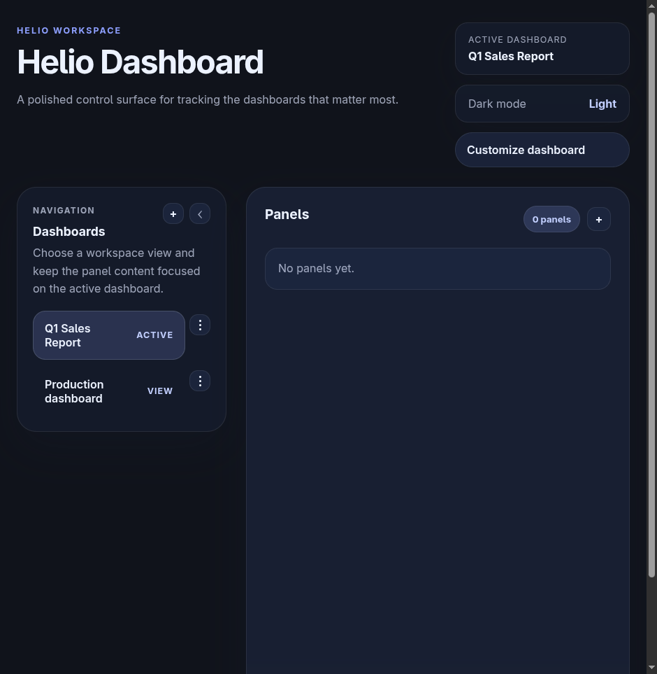
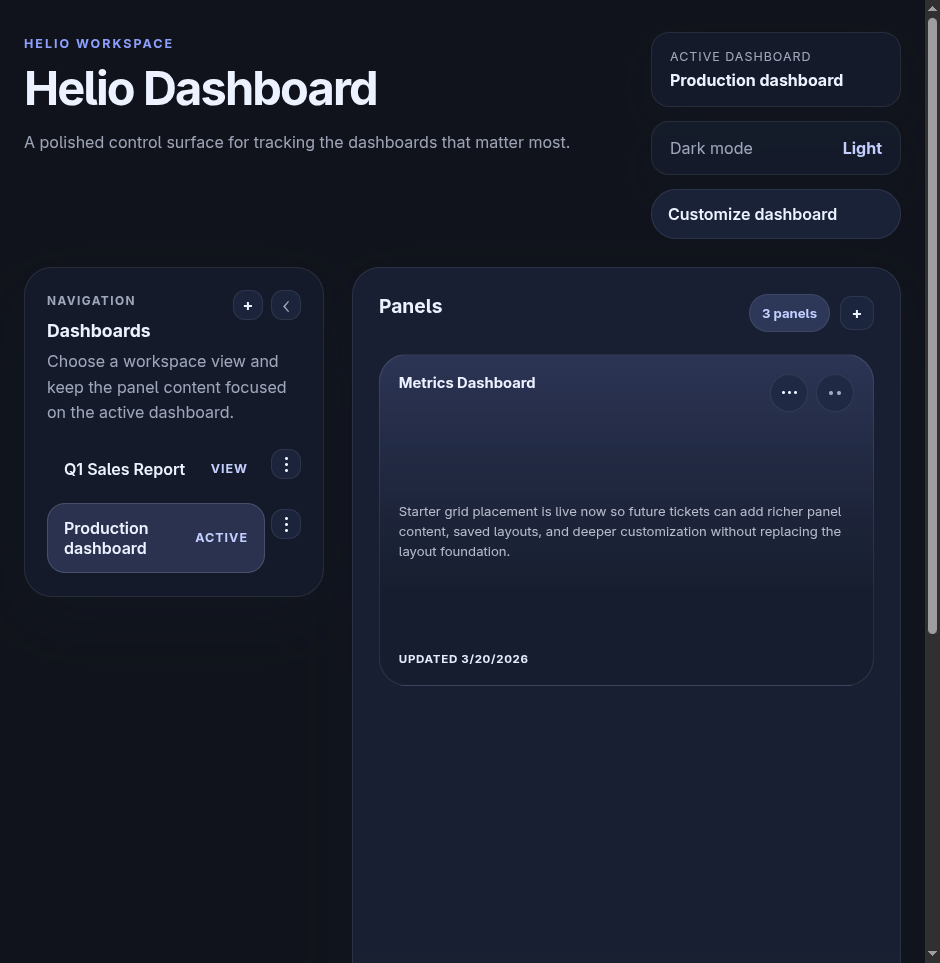
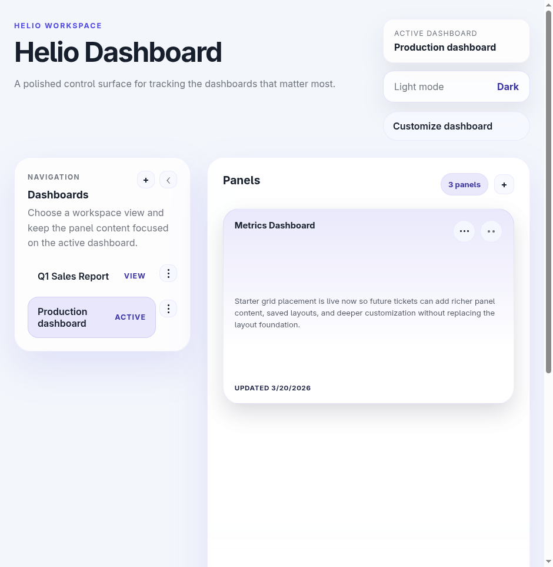
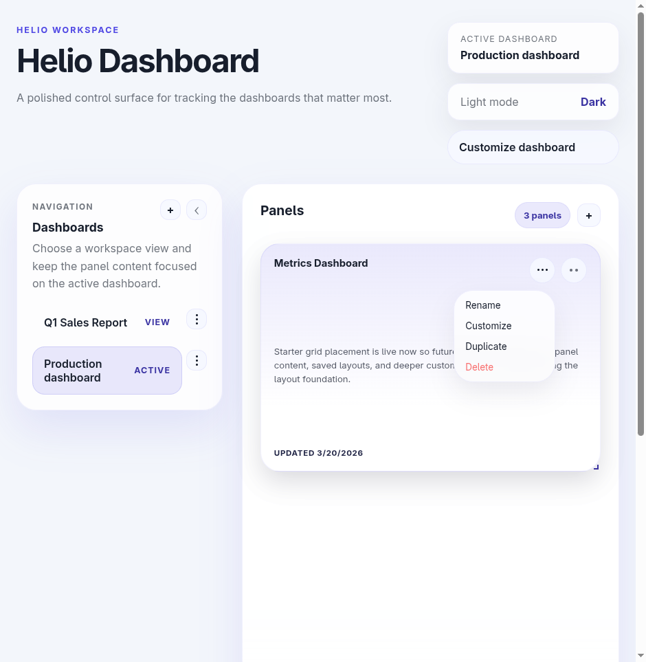
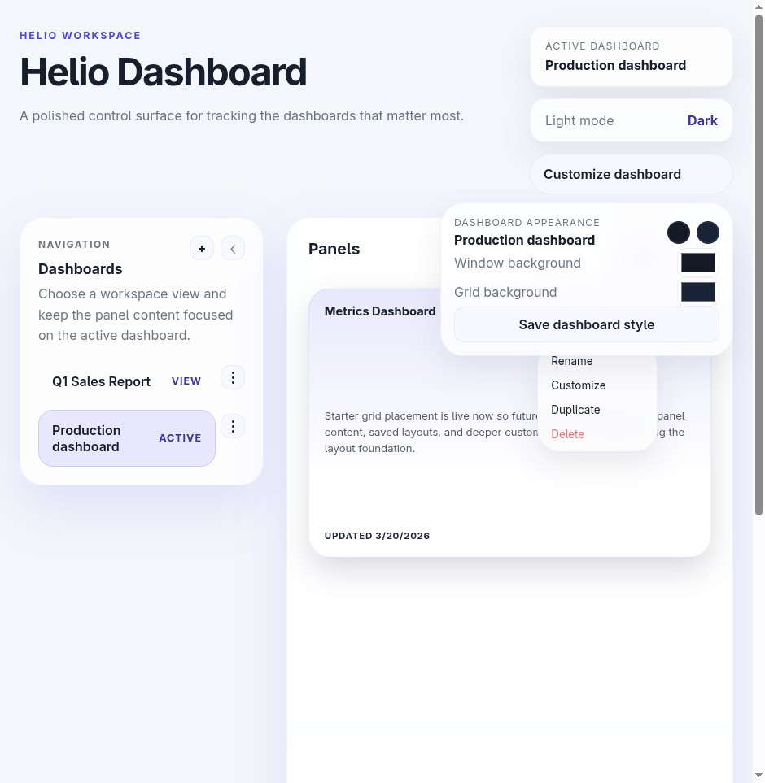

# Helio — Product Overview

**Last updated:** 2026-03-20
**App URL:** http://localhost:5173
**Backend:** Akka HTTP on port 8080

---

## What Helio Is

Helio is a dashboard builder — a flexible workspace for arranging data panels into visual dashboards. Target: **multi-tenant SaaS**, where each user or team has their own set of dashboards with access-controlled sharing.

The current version has all core scaffolding in place: a polished UI, persistent data, and solid CRUD workflows. Panels are structural containers today; the next phase gives them actual content.

---

## Current Feature Inventory

### Dashboards

- Create a new dashboard (custom name)
- Rename a dashboard
- Delete a dashboard (with confirmation)
- Switch between dashboards via the left sidebar
- Customize appearance: window background color, grid background color
- Light / dark theme toggle (global, not per-dashboard)
- Timestamps on all items (last updated)

### Panels

- Create a panel (custom title) within the active dashboard
- Rename a panel
- Delete a panel
- Duplicate a panel (appended with "(copy)")
- Move / drag panels in a responsive grid (React Grid Layout)
- Resize panels by dragging corners
- Customize appearance: background color, text color, transparency (0–100%)
- Layout positions persisted to the backend

### Navigation

- Left sidebar with collapsible dashboard list
- ACTIVE / VIEW status chips on each dashboard row
- Per-dashboard panel count badge

---

## Screenshots

### Home — empty dashboard (dark mode)

_Q1 Sales Report selected, 0 panels. Shows the sidebar, empty state message, and top-bar controls._

### Production dashboard — 3 panels (dark mode)

_3 panels: "Analytics Panel (copy)", "Metrics Dashboard", "Analytics Panel". Each panel shows placeholder description text and a last-updated timestamp._

### Production dashboard — light mode

_Same view in light mode. The theme switch is instant and applies globally._

### Panel actions menu

_Three-dot menu on a panel exposes: Rename, Customize, Duplicate, Delete._

### Dashboard appearance customizer

_"Customize dashboard" popover with window background and grid background color pickers. Note: the panel actions menu is also open simultaneously — both popovers stack without dismissing each other._

---

## Technology Stack

| Layer        | Tech                                                                    |
| ------------ | ----------------------------------------------------------------------- |
| Frontend     | React, Redux Toolkit, TypeScript, Vite                                  |
| State        | Redux slices (`dashboardsSlice`, `panelsSlice`) + `createAsyncThunk`    |
| Layout       | React Grid Layout (4 breakpoints: lg/md/sm/xs), debounced 250ms persist |
| Backend      | Scala, Akka HTTP, Akka Typed Actors                                     |
| Storage      | DB-backed (migrated from in-memory in HEL-14)                           |
| Styling      | Custom CSS, light/dark via React Context `ThemeProvider`                |
| API contract | JSON Schema 2020-12 (`schemas/`) + OpenAPI (`openspec/`)                |

---

## Completed Milestones (22 tickets)

| Ticket | Description                                        |
| ------ | -------------------------------------------------- |
| HEL-5  | Frontend Jest coverage (Redux slices + components) |
| HEL-6  | Backend POST endpoints for dashboards and panels   |
| HEL-7  | Frontend service modules connected to backend API  |
| HEL-8  | Dashboard selection flow                           |
| HEL-9  | Create dashboard connected to backend              |
| HEL-10 | Create panel connected to backend                  |
| HEL-11 | Backend route tests for malformed requests         |
| HEL-12 | Shared error and loading components                |
| HEL-13 | Dashboard and panel ordering semantics             |
| HEL-14 | Persisted storage                                  |
| HEL-15 | Modern styling + light/dark theme                  |
| HEL-16 | Appearance customization (colors, transparency)    |
| HEL-17 | Persisted panel layouts                            |
| HEL-18 | Delete dashboard                                   |
| HEL-19 | Delete panel                                       |
| HEL-20 | Rename dashboard                                   |
| HEL-21 | Edit panel title                                   |
| HEL-25 | Panel duplication                                  |
